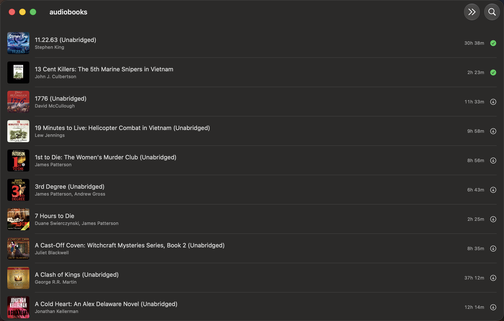
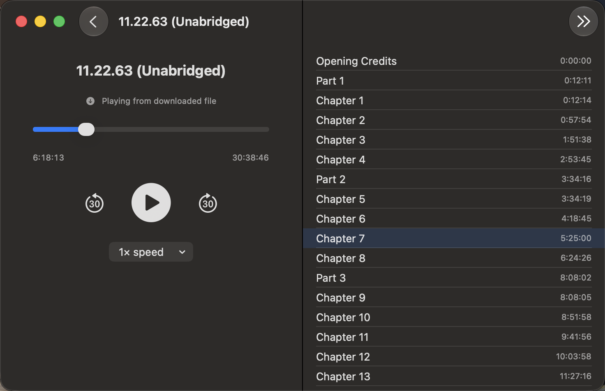

# AudiobookOffline

A native macOS app for [Audiobookshelf](https://github.com/advplyr/audiobookshelf) — browse your library, stream, download books for true offline playback, and keep listening progress synced back to your server.

Built because none of the existing Audiobookshelf clients do local pre-download for offline use; they stream only.

| Library | Player |
|---|---|
|  |  |

## Download

Grab the latest build from the [Releases page](https://github.com/shaynetroxler/AudiobookOffline/releases/latest) — download `AudiobookOffline.zip`, unzip, and drag `AudiobookOffline.app` to your Applications folder.

On first launch, macOS will say it can't verify the developer (this app isn't notarized — that requires a paid Apple Developer account). Go to **System Settings → Privacy & Security** and click **"Open Anyway"** next to the AudiobookOffline message. You only need to do this once.

## Features

- Log in to any self-hosted Audiobookshelf server
- Browse your library, search by title or author
- Browse by Series or Collections (created on the server; the app just displays them)
- Continue Listening shelf at the top of the Books tab — books you've started, sorted by most recent activity, so you don't have to search for what you're mid-book on; remove a book from the shelf any time from the player's ••• menu
- Library stats dashboard — item/hour/author/size/track counts, top genres and authors, longest and largest items
- Stream playback, or download a book for fully offline listening (list view and player both have a download control)
- Chapter list with jump-to-chapter
- Variable playback speed
- Spacebar play/pause on the player screen
- Sleep timer (5–60 min, or end of chapter)
- Now Playing integration — playback appears in macOS's Control Center widget and any menu bar/Dynamic Island app (e.g. [Alcove](https://tryalcove.com/)), with play/pause/skip and live progress
- Progress reported back to the server as you listen, with local caching so resume position still works with no network connection, and reconciled with the server whenever the app comes back to the foreground so progress made on another device (phone, tablet) is picked up correctly

## Requirements

- macOS 14+
- An Audiobookshelf server you can reach (local network or otherwise)

## Building from source

Open `AudiobookOffline.xcodeproj` in Xcode and hit Run. The project is generated with [XcodeGen](https://github.com/yonaskolb/XcodeGen) from `project.yml` — if you change targets/settings, edit `project.yml` and run `xcodegen generate` rather than editing the `.xcodeproj` directly.

Note: `project.yml` has a `DEVELOPMENT_TEAM` set to the original author's Apple ID. If you're building this yourself, change the Team in Xcode's Signing & Capabilities tab to your own (a free Apple ID / Personal Team is enough for local builds).

The underlying Swift Package (`Package.swift`) also still builds standalone via `swift build`, which is what CI uses to validate the code compiles — but it produces a bare unbundled executable, not a real double-clickable `.app`, so building via Xcode is the recommended path.

## Status

Working and in daily use. No open bugs as of this release. If something comes up, it'll land as a point release.

## License

MIT
